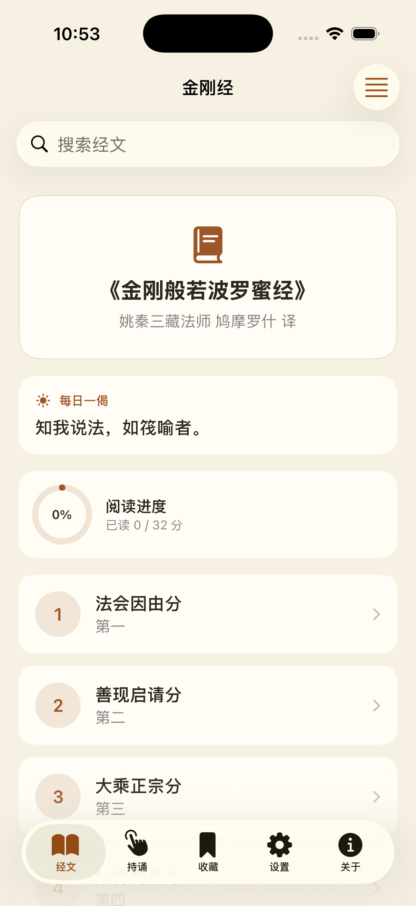

# 金刚经 · Diamond Sutra

A native iOS/iPadOS reader for the **《金刚般若波罗蜜经》** (Diamond Sutra, Kumārajīva translation),
built with SwiftUI. It presents the complete scripture across all **32 chapters (分)** with
chapter-by-chapter and full-text reading, Mandarin text-to-speech with live sentence
highlighting, and an adjustable, comfortable reading experience — fully offline.



## Features

- 📖 **Complete scripture** — all 32 分, from「法会因由分第一」to「应化非真分第三十二」.
- 📜 **Two reading modes** — per-chapter reader, or a continuous full-text scroll of the whole sutra.
- 🔍 **Full-text search** — search across all 32 分, with matches highlighted and tap-to-jump to the chapter.
- 🔊 **Read-aloud (TTS)** — Mandarin recitation via Apple's on-device `AVSpeechSynthesizer`,
  with the currently-spoken sentence highlighted live and adjustable speed (慢 / 正常 / 快).
- 📿 **Recitation counter (持诵)** — an interactive tap counter with haptics, daily + lifetime
  totals, and a configurable daily target (21 / 49 / 108 / 1080).
- 🔖 **Bookmarks (收藏)** — save chapters for quick return; swipe to remove.
- 📊 **Reading progress** — per-chapter read tracking with a progress ring and "continue reading".
- ☀️ **Verse of the day (每日一偈)** — a daily famous line, with an optional daily **local-notification** reminder.
- 📤 **Share** — share any chapter's text via the system share sheet.
- 🔠 **Adjustable text size** — scale the body type up or down; the preference persists.
- 🌙 **Light & dark mode** — a warm "sutra paper" theme via Asset Catalog color tokens.
- 📡 **Fully offline** — all text is bundled in the app; no network, no account, no data collected.
- 📱 **Universal** — adapts to both iPhone and iPad.

## Screens

The app uses a five-tab layout:

| 经文 (Read) | 持诵 (Recite) | 收藏 (Bookmarks) | 设置 (Settings) | 关于 (About) |
|---|---|---|---|---|
| Daily verse, progress ring, search, 32-chapter list | Tap counter with daily / lifetime totals + target | Saved chapters | Font size, speech speed, daily reminder | App info, developer, feedback, version |

## Tech stack

- **Swift 5** · **SwiftUI** (declarative UI, `TabView` + `NavigationStack`, `.searchable`, `ShareLink`)
- **AVFoundation** — `AVSpeechSynthesizer` for Mandarin text-to-speech
- **UserNotifications** — opt-in daily local-notification reminder (每日一偈)
- **UserDefaults** — persists bookmarks, reading progress, recitation counts and preferences
- **XcodeGen** — project generated from [`project.yml`](project.yml)
- Deployment target **iOS 17+**, universal (iPhone + iPad)

## Project structure

```
project.yml                 # XcodeGen project definition
Sources/
  JingangJingApp.swift      # @main app entry (injects AppStore, refreshes reminder)
  MainTabView.swift         # root TabView: 经文 / 持诵 / 收藏 / 设置 / 关于
  AppStore.swift            # persisted state: bookmarks, progress, recitation counter, reminder
  SutraData.swift           # full text of all 32 分 + search + verse-of-the-day
  SutraHomeView.swift       # daily verse, progress ring, full-text search, chapter list
  ChapterDetailView.swift   # per-chapter reader (TTS + highlight + font + bookmark + share)
  FullTextView.swift        # continuous full-sutra reading
  ReciteView.swift          # 持诵 recitation counter (daily/lifetime totals + target)
  BookmarksView.swift       # 收藏 saved chapters
  SettingsView.swift        # 设置 font / speed / daily reminder / progress reset
  SpeechManager.swift       # AVSpeechSynthesizer wrapper
  NotificationManager.swift # daily verse local-notification scheduling
  FeedbackView.swift        # WhatsApp feedback form (reached from About)
  AboutView.swift           # app / developer / feedback / version
  Theme.swift               # central color tokens
Resources/
  Info.plist
  Assets.xcassets           # AppIcon + theme color sets
```

## Building

Requires Xcode 16+ and [XcodeGen](https://github.com/yonyz/XcodeGen) (`brew install xcodegen`).

```bash
xcodegen generate
open JingangJing.xcodeproj
# or build from the command line:
xcodebuild -project JingangJing.xcodeproj -scheme JingangJing \
  -destination 'platform=iOS Simulator,name=iPhone 17 Pro' build
```

The Xcode project is generated from `project.yml` and is not checked in — run
`xcodegen generate` after cloning.

## Acknowledgements

- Scripture: 《金刚般若波罗蜜经》, 姚秦三藏法师 鸠摩罗什 译 (public domain).
- Developed by **Tertiary Infotech Academy Pte Ltd** — [tertiaryinfotech.com](https://www.tertiaryinfotech.com)

---

> 一切有为法，如梦幻泡影，如露亦如电，应作如是观。
